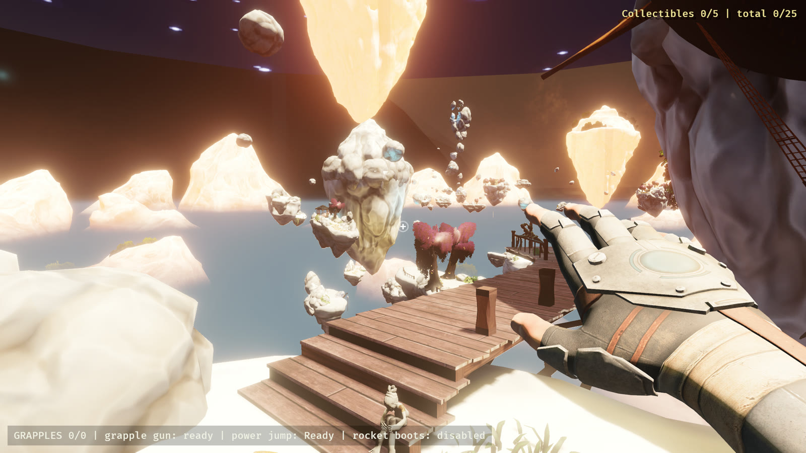
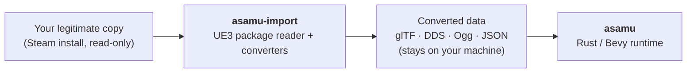
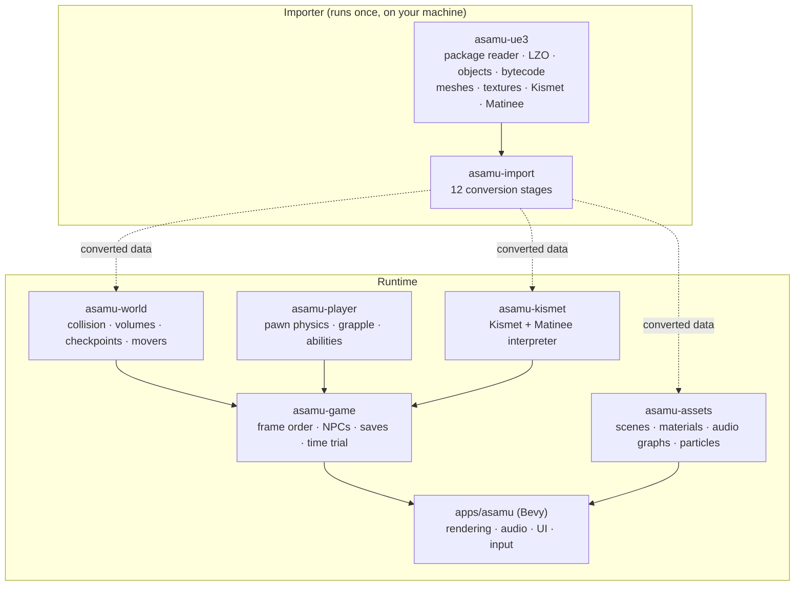
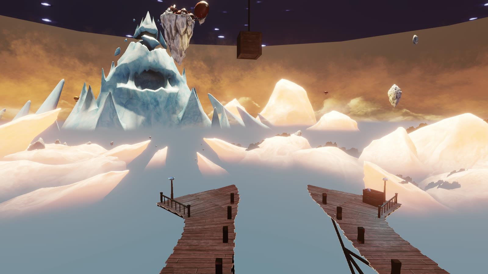
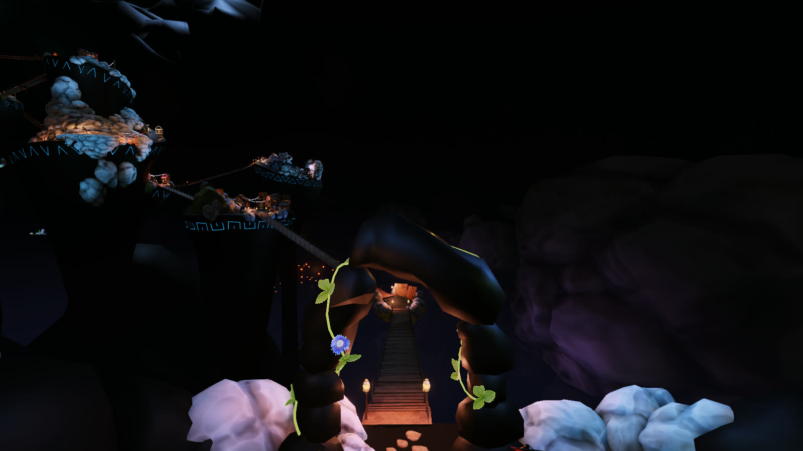
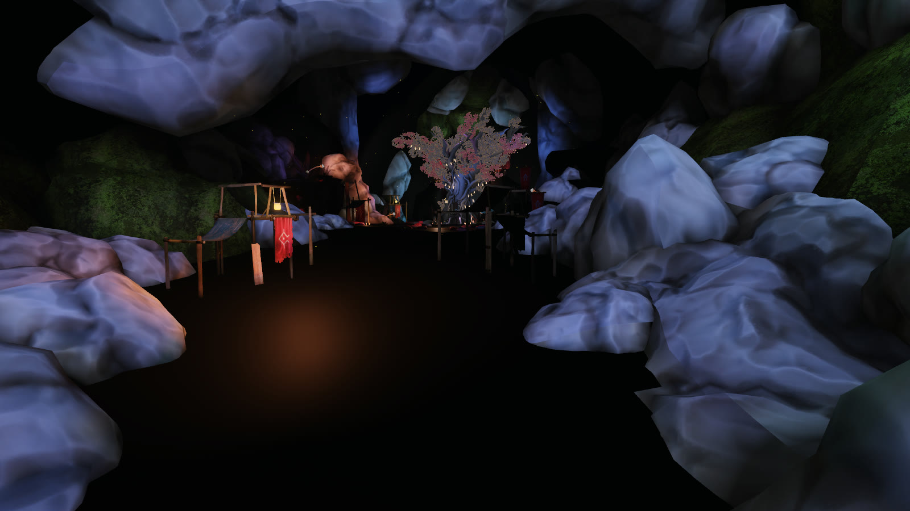

# ASAMU-decomp

[](https://github.com/bailo167/ASAMU-decomp/actions/workflows/ci.yml)


**An open-source engine recreation of *A Story About My Uncle*, written from scratch in Rust and Bevy, that plays
the original game's levels from your own legitimately owned copy.**

<p align="center">
  
  <br>
  <em>The recreation running <code>AG-StarHaven</code>, imported locally from an owned copy of the game.
  <a href="#screenshots">More screenshots</a></em>
</p>

> **Unofficial project.** Not affiliated with, endorsed by, or connected to Gone North Games or Coffee Stain Studios.
> This repository contains **no original copyrighted game assets, code or data**. To use it you will need your own
> legitimate copy of *A Story About My Uncle*; the importer converts data locally from your installation.

## What this is

ASAMU-decomp is a **clean reimplementation** of the game's engine and rules: a new, native runtime built on
[Bevy](https://bevyengine.org), plus an importer that reads the Unreal Engine 3 packages of an original Steam
install and converts them, on your machine, into formats the runtime loads (glTF, DDS, Ogg and JSON, plus a few
raw buffers of our own for BSP geometry and lightmaps). It was built by reverse engineering a legitimately owned
copy, and every recovered gameplay value is recorded with its source.

It is **not** a mod, a wrapper, an injector or a patched copy of the original executable, and it ships none of the
game. Without your own copy you get a small gray test level; with it you get the game's own levels, scripting,
characters and sound running in a modern cross-platform engine.

The project is **pre-alpha**. A lot works; the limits are listed [just as plainly](#current-limitations).

## Current state

With your own copy imported, this works today:

| Area | What runs |
|---|---|
| **Levels** | All seven story maps load with their geometry, placements and streamed sub-levels: Workshop, Paradise Cave, Beautiful City, Dark Cave, Star Haven, Ice Cave (with The Core) and the Epilogue. |
| **Movement** | A port of the original engine's pawn physics (walking, falling, flying, stepping, braking) driven by the values recovered from the game's own data: walk and sprint speeds, acceleration, air control, releasable jump, landing. |
| **Grapple and abilities** | The grapple (targeting, range, pull, every release rule, limited charges, recharge crystals), the power jump and the rocket boots, ported from the original's script behaviour. |
| **Level scripting** | An interpreter for Kismet, the game's visual scripting: all 97 kinds of sequence object used by the 12 shipped maps (3,207 placed objects), plus Matinee tracks for moving platforms, cutscene cameras and timed events. |
| **Collision** | Triangle collision against the converted level geometry and BSP, moving-platform collision, trigger and kill volumes, checkpoints. |
| **Rendering** | Static meshes, approximate materials, the original baked lightmaps, skinned characters with their animations, particle systems, decals, water and foliage, height fog, the levels' colour grading and bloom. |
| **Characters** | Maddie, the villagers, the Dark Cave worm, collectibles and story interactables, and the first-person hand with its animations. |
| **Audio** | Sound cues, ambient sound, narration with subtitles, and the adaptive music system. |
| **Game shell** | Main menu, chapter select, pause and settings; saving and progression; text in the game's 14 languages; time trial with medals (unlocked by finishing the game, as in the original); keyboard and mouse with the original bindings. Gamepad support is partial: look, jump, pause and checkpoint restart work; stick movement, grapple, sprint and power jump are mapped from the original bindings but not connected to the simulation yet. |
| **Campaign path** | The scripted exit of every level leads to the next, from the Workshop to the Epilogue, in an automated run. |
| **Platforms** | Every push is built on Windows, Linux and macOS (Apple silicon), with an Intel-macOS compile check; the library and tool crates' tests run on all three. |

## Current limitations

- **Behavioural parity is not measured yet.** Movement, grapple and abilities are ported from recovered values and
  specifications, but they have not been compared tick by tick against recordings of the original game. The
  recorder and comparison tools exist, the first recordings were made in October 2026, and the first replay
  diverges; the causes found so far are tooling limits and open questions, not yet classified simulation
  differences ([docs/PARITY.md](docs/PARITY.md)). Until those numbers exist, nothing about "feels like the
  original" is claimed as verified.
- **Nobody has played it start to finish.** The campaign chain above is proven by an automated run that jumps to
  each level's exit trigger. It shows the scripted transitions work, not that every route is traversable by hand.
- **Rendering is an approximation.** Materials are reduced to a standard PBR model, lightmaps lose their
  directional detail, some effects (fog volumes, motion blur, ambient occlusion) are not drawn, and a few
  materials still show as flat placeholders. Lighting and colour can differ visibly from the original.
- **Some scripted objects never appear.** Props and platforms that start hidden and are shown later by the level
  script (13 across six maps) are not drawn yet.
- **The original's menus and HUD are not reproduced.** They are Scaleform movies; a functional replacement stands
  in. Tutorial art, the title logo and the credits movie use placeholders.
- **Only one build of the game is verified:** the macOS Steam build 1822049. The locator knows the expected layout
  of a Windows install and the importer will attempt a conversion, but it has never been run on one.
- **Saves from the original cannot be imported.** The recreation keeps its own saves.
- **No packaged release yet.** The release pipeline exists but has not been run; for now you build from source.

Known gameplay differences are listed in [docs/PARITY.md](docs/PARITY.md), and open integration and rendering
gaps in [docs/INTEGRATION.md](docs/INTEGRATION.md) (section 10).

## Quick start

You need a [Rust toolchain](https://rustup.rs) and *A Story About My Uncle* installed through Steam.

```bash
git clone https://github.com/bailo167/ASAMU-decomp
cd ASAMU-decomp
cargo build --release -p asamu -p asamu-import

# Convert your copy (found through Steam; read-only; about a minute and 2.3 GB on your disk)
cargo run --release -p asamu-import -- all

# Play one level directly (progress is kept in memory only)
cargo run --release -p asamu -- --level AG-Workshop
```

For the main menu with saves on disk, run `asamu --converted <folder>` with the importer's output folder and no
`--level` (the folder is printed by the importer; [Playing](docs/PLAYING.md) lists the defaults). `asamu` with no
options starts the built-in test level, which needs no game data.
Linux needs a few system packages first, and the importer has options for other install locations:
see [Building](docs/BUILDING.md) and [Playing](docs/PLAYING.md).

Converted data is copyrighted game data. It stays in a folder on your machine; do not share it.

## How it works



The importer (and the developer tool `asamu-inspect`) are the only parts that read Unreal Engine 3 packages. The
runtime never links the package reader: it loads the converted formats and never locates or reads the install.



The simulation (`asamu-player`, `asamu-world`, `asamu-kismet`, `asamu-game`) is deterministic and runs without a
renderer at a fixed step, which is what makes it testable in CI and comparable with the original.
[Architecture](docs/ARCHITECTURE.md) has the details.

## Technical highlights

- **The game's script package was hiding in plain sight.** There is no `ASAMU.u` on disk: the cooker merged it
  into `Startup.upk`, where package `asamu` holds all **172 game classes**. The only native ASAMU code is a
  settings manager; the grapple is an UnrealScript weapon running on stock engine pawn physics.
- **All 42 shipped UE3 packages parse** (file version 868; the 38 compressed ones decompress from LZO1X chunks)
  with a reader written from scratch and cross-checked against an independent implementation. 70,946 script objects and 2,521 class default
  objects decode with every byte accounted for.
- **A bytecode decoder for all 12,801 compiled scripts** (12,511 functions, 211 states and 79 classes with
  class-level code), whose token table matches the executable's.
- **Exact asset decoding where it can be proven:** all 1,512 static meshes re-encode byte for byte from their
  decoded fields; 8,920 textures and 30,284 placed actors agree with an independent decoder.
- **Native physics recovered from an unstripped binary.** The macOS executable still carries about 135,000
  symbols, which made it possible to write a detailed specification of the engine's pawn movement and port from
  it. Agreement with the running game is not measured yet.
- **Every gameplay constant has provenance.** Ground speed 440, jump velocity 1000, grapple range 5000: each value
  in the runtime cites the class default, config file or native code it came from, and a test fails if they drift.
- **Read-only parity recorders for the original game:** a memory-reading recorder for the Windows build, which
  made the first recordings (position, velocity, view and grapple state per frame), and an LLDB script for the
  macOS build under Rosetta, which passes its attach and layout checks but has not recorded a trace yet. The
  recordings are replayed through the recreation and compared.
- **No game data in the repository, enforced by tooling.** A hygiene check in CI rejects game file formats, binary
  payloads and private paths, and flags decompiler output; the importer is the only way data reaches the runtime.

The evidence, with confidence labels on its claims, is in
[`docs/reverse-engineering/`](docs/reverse-engineering) (34 documents).

## Screenshots

All of these are the recreation, rendering data imported locally from an owned copy.

| | |
|---|---|
|  |  |
| *`AG-StarHaven`* | *`AG-BeautifulCity`* |
|  |  |
| *The village market in `AG-BeautifulCity`* | *First person, with the converted glove and the stand-in HUD* |

## Platforms

| Platform | Target | Status |
|---|---|---|
| Windows | `x86_64-pc-windows-msvc` | Built in CI on every push; library and tool tests run |
| Linux | `x86_64-unknown-linux-gnu` | Built in CI on every push; library and tool tests run |
| macOS (Apple silicon) | `aarch64-apple-darwin` | Built in CI on every push; library and tool tests run; the development machine |
| macOS (Intel) | `x86_64-apple-darwin` | Compile-checked in CI |

CI proves the code compiles on each system and that the library and tool tests which need no game data pass. The
Bevy app's own tests, and every test that reads game data, run only on the development Mac. Playing on Windows
and Linux has not been tested by hand yet.

## Progress

**Current milestone:** M11 — Full game/story path (core gameplay, Kismet story scripting, NPCs, audio, menus and saves connected; measuring parity against recordings of the original has started)

"Implemented" below means the code exists and passes its own tests. "Verified" is counted separately: for format,
asset and importer items the result was checked against the original's data or a second, separately written
decoder; for tooling items the check runs green in CI; for collision our queries agree with a brute-force
oracle. Nothing is verified against the running game's behaviour, and gameplay items stay unverified until the
parity comparisons pass.

<p align="center"></p>

<!-- progress-table:start -->
<!-- generated by `cargo run -p progress-gen`; do not edit by hand -->

| Category | Items | Implemented + verified | Verified | In progress | Completion | Verified % |
|---|---:|---:|---:|---:|---:|---:|
| Binary RE | 8 | 8 | 4 | 0 | 100% | 50% |
| Symbols | 7 | 7 | 4 | 0 | 100% | 57% |
| UE3 Packages | 10 | 10 | 9 | 0 | 100% | 90% |
| Compression | 6 | 6 | 6 | 0 | 100% | 100% |
| Objects | 6 | 6 | 5 | 0 | 100% | 83% |
| UnrealScript | 8 | 8 | 6 | 0 | 100% | 75% |
| Kismet | 6 | 6 | 3 | 0 | 100% | 50% |
| Maps | 7 | 7 | 6 | 0 | 100% | 85% |
| Assets | 10 | 10 | 10 | 0 | 100% | 100% |
| Player | 10 | 9 | 0 | 1 | 90% | 0% |
| Grapple | 8 | 8 | 0 | 0 | 100% | 0% |
| World | 13 | 13 | 0 | 0 | 100% | 0% |
| Rendering | 12 | 12 | 1 | 0 | 100% | 8% |
| Audio | 5 | 5 | 0 | 0 | 100% | 0% |
| Save/Progression | 5 | 5 | 0 | 0 | 100% | 0% |
| Importer | 7 | 7 | 5 | 0 | 100% | 71% |
| Platforms | 5 | 5 | 0 | 0 | 100% | 0% |
| Tests | 10 | 9 | 3 | 1 | 90% | 30% |
| **Overall** | **143** | **141** | **62** | **2** | **98%** | **43%** |

<!-- progress-table:end -->

Percentages are computed by [`tools/progress-gen`](tools/progress-gen) from the enumerated items in
[`progress/progress.toml`](progress/progress.toml): completion = (implemented + verified) / total, floored.
Verified is reported separately. Status definitions are in [CLAUDE.md](CLAUDE.md#progress-tracking--no-fake-progress).

## Workspace

| Path | Purpose |
|---|---|
| `apps/asamu` | The Bevy executable: rendering, audio, UI, input |
| `crates/asamu-core` | Shared math, units, coordinate conventions, deterministic trig |
| `crates/asamu-player` | Deterministic, render-free pawn physics, grapple, abilities and trace format |
| `crates/asamu-world` | Level scenes, collision, volumes, checkpoints, world objects |
| `crates/asamu-kismet` | Kismet and Matinee interpreter |
| `crates/asamu-game` | Frame order, level script host, NPCs, saves, time trial |
| `crates/asamu-assets` | Runtime view of converted data: scenes, materials, audio graphs, particles |
| `crates/asamu-ue3` | Defensive reader for the game's UE3 package generation (importer and inspection tool only) |
| `tools/asamu-import` | Converts an original install into user-local data (`asamu-import all`) |
| `tools/asamu-locate`, `asamu-inventory` | Find the Steam install; sanitized inventory of its files |
| `tools/asamu-inspect`, `asamu-symbols` | Inspect packages and maps; classify the original executable's symbols |
| `tools/asamu-trace`, `trace-recorder` | Record the original game (read-only) and compare it with the recreation |
| `tools/progress-gen`, `repo-hygiene` | Progress matrix generator; refuses game data and RE dumps in commits |

## Documentation

- **Using it:** [Playing](docs/PLAYING.md) · [Building](docs/BUILDING.md)
- **How it is built:** [Architecture](docs/ARCHITECTURE.md) · [Integration](docs/INTEGRATION.md) ·
  [UI and saves](docs/UI_AND_SAVES.md)
- **How faithful it is:** [Parity](docs/PARITY.md) · [Trace capture](docs/TRACE_CAPTURE.md)
- **Where it stands:** [Status](docs/STATUS.md) · [Roadmap](docs/ROADMAP.md) · [Showcase copy](docs/SHOWCASE.md)
- **Reverse engineering:** [Packages](docs/reverse-engineering/PACKAGE_ANALYSIS.md) ·
  [Script](docs/reverse-engineering/SCRIPT_ANALYSIS.md) ·
  [Native physics](docs/reverse-engineering/NATIVE_PHYSICS.md) · [Grapple](docs/reverse-engineering/GRAPPLE.md) ·
  [Kismet](docs/reverse-engineering/KISMET.md) · [Levels](docs/reverse-engineering/LEVELS.md) ·
  [Binary](docs/reverse-engineering/BINARY_ANALYSIS.md) · [all 34](docs/reverse-engineering)
- [Legal scope](docs/LEGAL.md)

## Legal scope

This project distributes only independently written code, tooling, tests, format documentation and sanitized
metadata (hashes, counts, names needed to explain structure). It never distributes the original executable,
packages, maps, textures, meshes, audio, video, or decompiled code. See [docs/LEGAL.md](docs/LEGAL.md).

The screenshots in this README show the recreation running data that was converted locally from an owned copy;
they are included to illustrate the project.

Code is dual-licensed under MIT or Apache-2.0; see [LICENSE](LICENSE). *A Story About My Uncle* and all of its
assets are the property of their respective owners.
