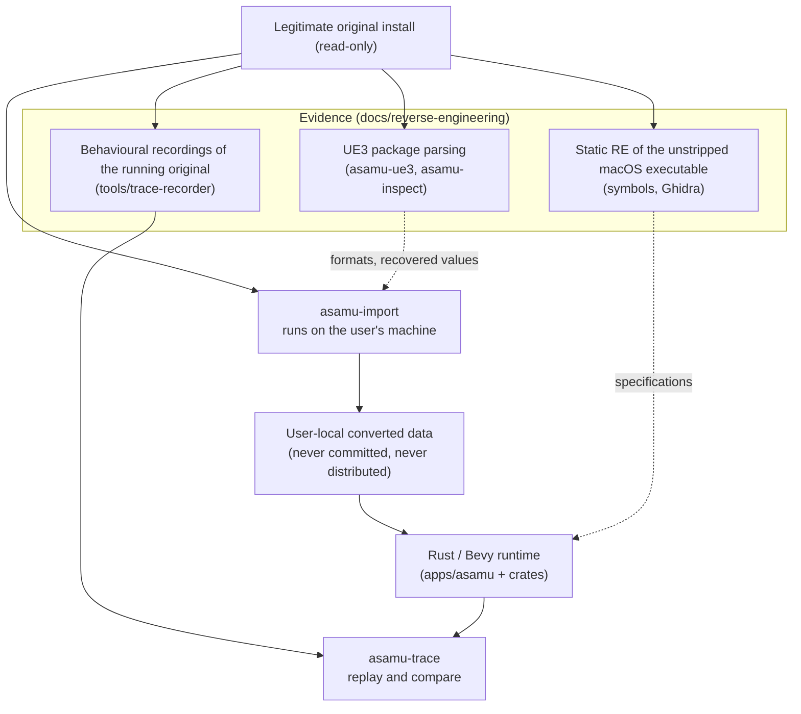

# Architecture

ASAMU-decomp is an **engine recreation** (universal-modder Pattern 4). The original game is used only as
read-only evidence and as a behavioural oracle; our runtime is new code.

## Crates

| Crate | Responsibility | Depends on |
|---|---|---|
| `asamu-core` | Shared math (glam), units, coordinate conventions, deterministic trig, config types | — |
| `asamu-player` | Deterministic, render-free simulation of the player: the port of the engine's pawn physics, the pawn script layer, grapple gun, power jump, rocket boots, parameters with provenance, trace format | core |
| `asamu-world` | Level scenes in runtime form: triangle collision, volumes, checkpoints, kill zones, movers, world objects (recharge crystals, attractor pads, falling rocks), the built-in graybox level | core |
| `asamu-kismet` | Interpreter for the levels' Kismet graphs and Matinee tracks; talks to the game through a host interface | core |
| `asamu-game` | The game frame: tick order, level script host, NPCs and the worm, saves and progression, time trial, the smoke harness | core, player, world, kismet |
| `asamu-assets` | Runtime view of converted data: level render plans, material descriptions, sound cue evaluation, particle simulation, lightmap and localization tables | core |
| `asamu-ue3` | Defensive reader for the game's UE3 package generation (v868): summary, tables, LZO, objects and properties, bytecode, meshes, textures, materials, Kismet, Matinee, audio, particles | — |
| `apps/asamu` | The Bevy executable: windowing, input, rendering, audio output, UI, and the glue that presents the simulation | core, player, game, assets, bevy |

Tools: `asamu-import` (the converter; the only user of `asamu-ue3` besides the inspection tools), `asamu-locate`
(Steam discovery), `asamu-inventory` (sanitized install inventory), `asamu-inspect` (package/map inspection),
`asamu-symbols` (symbol statistics), `asamu-trace` and `tools/trace-recorder` (record the original read-only,
replay through the simulation, compare), `progress-gen`, `repo-hygiene`.

How the pieces run together inside one frame is described in [INTEGRATION.md](INTEGRATION.md).

## Boundaries

1. **Importer ↔ runtime.** Only the importer knows about UE3 serialization or Steam paths. The runtime reads
   converted, open formats (glTF meshes, DDS textures, Ogg audio, versioned JSON for scenes, materials, Kismet
   graphs, Matinee tracks, particles and text). The runtime does not link `asamu-ue3` at all
   (`cargo tree -p asamu` shows no path to it), and the renderer is not taught UE3 formats.
2. **Simulation ↔ rendering.** `asamu-player` and `asamu-world` expose pure step functions on plain data at a
   fixed timestep. Bevy systems call into them. This makes trajectory traces reproducible and testable in CI.
3. **Evidence ↔ implementation.** Every gameplay constant in the runtime cites its source (script default
   property, native code, config, or a measured trace). Placeholders are explicitly marked as such.
4. **Classic ↔ experiments.** The faithful game ("Classic": original parameters, original tick order, the parity
   tooling) is the authoritative target. Anything experimental has to live beside it, not inside it: it may read
   and wrap the simulation, but the Classic path must behave bit-identically whether or not the experiment is
   compiled in.

## Coordinate conventions

Implemented in `crates/asamu-core` (`units`, `coords`, `rotator`, `clock`); tested there.

| System | Handedness | Forward | Right | Up | Unit | Used by |
|---|---|---|---|---|---|---|
| UE3 | left-handed | +X | +Y | +Z | Unreal units (UU) | simulation, traces, importer, level data |
| Bevy | right-handed | −Z | +X | +Y | presentation scale | rendering only (`apps/asamu`) |

- **The simulation runs in UE3 axes and UU.** Recovered constants (script defaults, native code, config,
  traces) can then be used verbatim and parity is evaluated in UU without rescaling.
- **UE3 → Bevy:** `bevy = (ue.y, ue.z, −ue.x) · scale` (`coords::ue_pos_to_bevy`; inverse
  `bevy_pos_to_ue`). The linear part is orthogonal with determinant **−1** (it flips handedness, as a
  left- to right-handed change must), so cross products change sign (`M a × M b = −M (a × b)`): normals
  derived from cross products and triangle winding need care in the importer. Extents/sizes convert
  without sign (`ue_extents_to_bevy`). Applied once, at the render boundary (and later in the importer).
- **Scale:** `units::PRESENTATION_UU_PER_METRE = 50` (1 UU = 2 cm) is a commonly quoted UE3-era
  **convention used only for presentation** (Bevy rendering, HUD m/s). It is **not** a recovered ASAMU fact
  and nothing in the simulation depends on it.
- **Rotations:** UE3 rotators use 65536 units per turn (engine convention; `rotator` module, with UE3
  `NormalizeAxis` semantics). The simulation stores yaw/pitch in radians; view direction is
  `(cos p · cos y, cos p · sin y, sin p)` (+yaw turns right, +pitch looks up), and the Bevy camera rotation
  is `Ry(−yaw) · Rx(pitch)` (`coords::ue_view_to_bevy_rotation`). The axis/rotator conventions are standard
  UE3 knowledge; that ASAMU's data uses them unchanged is **TENTATIVE** until checked against parsed map
  data and recorded traces. FOV parameters are treated as horizontal (UE3 convention, **TENTATIVE** for
  ASAMU) and converted to Bevy's vertical FOV using the window aspect.
- **Time:** the simulation uses a fixed step (`clock::FixedClock`, default 60 Hz). This is a **runtime
  choice**. The original advances actors with a variable `DeltaTime` (CONFIRMED on the Windows build: the
  recorded `DeltaSeconds` equals the frame's tick argument on every recorded frame, clamped to 0.0005–0.4 s),
  so traces of the original are replayed with each frame's own length (`asamu-trace replay`, variable-step
  mode). `sim::step` clamps a single `dt` to `sim::MAX_STEP_DT` (a numerical safety
  bound, not a gameplay value) and treats a non-finite or non-positive `dt` as a no-op.
- **Determinism:** the simulation uses only IEEE-754 basic arithmetic, `sqrt`, exact operations and
  `det_math::sin_cos` (pure Rust; never the platform `sin`/`cos`, whose last bit can differ between
  OS maths libraries). Rust does not contract `a * b + c` into FMA and the supported targets have no
  extended-precision float arithmetic, so runs are expected to be bit-identical across Windows, Linux and
  macOS. `det_math` is pinned by golden bit patterns; whole-run identity across platforms is **TENTATIVE**
  until the same trace has been produced on each OS. Render-side helpers (`ue_view_to_bevy_rotation`, the
  app's FOV conversion) may use platform maths; nothing flows from them back into the simulation.

## Behavioural traces

Implemented in `crates/asamu-player/src/trace.rs`; the format (JSON Lines: one `TraceMeta` line, then one
`TraceSample` per tick with input, position, velocity, yaw/pitch, FOV, grapple state/anchor/rope length,
grounded) and the comparison metrics are specified in [PARITY.md](PARITY.md#trace-format). Recordings of the
original game and runtime traces share the schema.

- **Recording the original** ([TRACE_CAPTURE.md](TRACE_CAPTURE.md)): read-only recorders sample the running game
  once per frame, an LLDB script for the macOS build and a memory-reading poller for the Windows build. They never
  write to the game's process or files. `asamu-trace convert` turns a raw recording into canonical traces.
- **Replaying:** `asamu-trace replay` feeds a trace's inputs through the deterministic simulation on the graybox
  or on a converted level, with fixed ticks or with each recorded frame's own length, and
  `asamu-trace compare` aligns two traces by tick and reports per-field max/mean/RMS error and the first
  divergence above a tolerance.
- `trace::record_run` records a runtime trace from a sequence of inputs; `asamu_game::Game` can record live
  sessions (F9 in the app writes JSONL to `$ASAMU_TRACE_DIR` or the temp dir). Tests prove runtime traces are
  bit-reproducible and round-trip losslessly.
- **Simulation boundary for parity.** `sim::step` is pure (no globals, RNG, wall clock, hash ordering or
  hidden state; a test interleaves two simulations and compares bytes with isolated runs). Hostile input is
  contained: inputs are sanitized, and a step that would produce a non-finite state leaves the state
  unchanged and reports `StepEvents::non_finite_rejected`.
- **Movement model.** Locomotion sits behind `movement::MovementModel`. The default, `Ue3PawnMovement`, is a
  port of the engine's native pawn physics as specified in
  [NATIVE_PHYSICS.md](reverse-engineering/NATIVE_PHYSICS.md), driven by the recovered ASAMU parameters; the
  grapple, power jump and rocket boots follow [GRAPPLE.md](reverse-engineering/GRAPPLE.md) and
  [ABILITIES.md](reverse-engineering/ABILITIES.md). The older `PlaceholderMovement` remains only as a debugging
  model. How far the port agrees with the original is what the trace comparison measures; see
  [PARITY.md](PARITY.md) for the current numbers and the known deviations.
